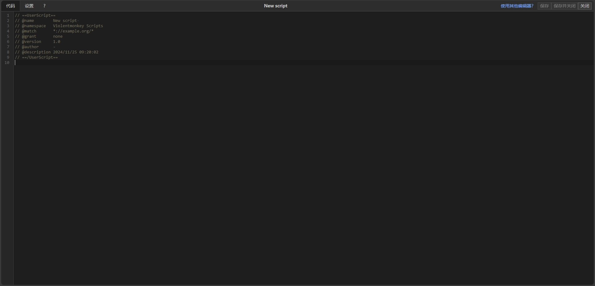

# DUT_TeacherEvaluation_Auto_Submit_Tool
实现 大连理工大学教务系统学生总结性评教问卷 的 一键自动填写及提交 的 油猴脚本工具

参考了 [Nouchi-Kousu 的项目](https://github.com/Nouchi-Kousu/Dlut_auto-StudentSummativeEvaluation)。感谢 [@Houyi2333](https://github.com/Houyi2333) 和 [@Nouchi-Kousu](https://github.com/Nouchi-Kousu) 对本项目的贡献。

目前实现的功能是：进入每位老师的问卷页面后，点击页面左下角按钮实现一键自动填写并提交。暂时没实现一键提交所有教师的问卷的功能，可能什么时候有时间了会写吧。

由于带工教务系统的 URL 的路由规则非法，脚本会在进入教务系统首页就启动，目前无解，不过不影响脚本正常使用。

截至目前该脚本功能正常。由于未来问卷系统可能出现变化，如果该脚本出现问题，欢迎提 Issue。

2025.5.20更新：新版代码似乎会导致莫名其妙的 500 错误，现已回退上个版本。至于为什么会出问题等我有空再好好看看，现在没啥时间= =
---

本工具为 Tampermonkey 油猴脚本，安装方法见下：

以 暴力猴 为例，添加自定义脚本，直接把脚本的 JavaScript 代码粘贴进去保存即可：

